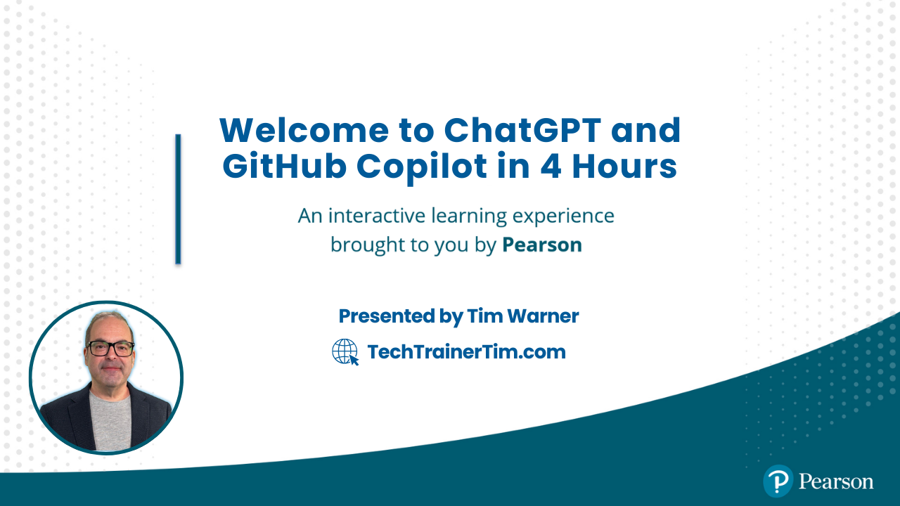

# 📘 ChatGPT and GitHub Copilot in 4 Hours 🚀

---

## 🔗 Related Repositories

---

## 📞 Contact Tim Warner

- **Email**: [timothywarner316@gmail.com](mailto:timothywarner316@gmail.com)
- **LinkedIn**: [Timothy Warner](https://www.linkedin.com/in/timothywarner/)
- **Website**: [Tech Trainer Tim](https://techtrainertim.com)
- **Azure OpenAI Blog**: [azureopenai.blog](https://azureopenai.blog)
- **Social Media**: [Bluesky](https://bsky.app/profile/techtrainertim.bsky.social) | [Mastodon](https://mastodon.social/@techtrainertim)

---

## 📚 Key Resources and Links

### 🤖 Responsible AI Resources

- **[OpenAI Safety & Responsibility](https://openai.com/safety)** - OpenAI's principles and practices for responsible AI development
- **[Microsoft Responsible AI](https://www.microsoft.com/en-us/ai/responsible-ai)** - Microsoft's comprehensive approach to ethical AI
- **[Responsible AI White Paper](https://blogs.microsoft.com/wp-content/uploads/prod/sites/5/2023/02/The-new-Bing-Our-approach-to-Responsible-AI.pdf)** - Detailed insights into Microsoft's AI ethics

### AI Model Documentation & APIs

- **[OpenAI Documentation](https://platform.openai.com/docs/)** - Official documentation for ChatGPT and OpenAI’s API capabilities.
- **[GitHub Copilot Documentation](https://docs.github.com/en/copilot)** - Comprehensive guide on using GitHub Copilot, including setup and feature details.
- **[Anthropic Claude](https://www.anthropic.com/)** - Explore the Claude LLM developed by Anthropic, aimed at safe and controllable AI interactions.
- **[Google Gemini](https://cloud.google.com/)** - Google’s Gemini LLM, integrated into Google Cloud for various business and technical applications.

### GitHub Copilot Resources

- **[GitHub Copilot Business](https://docs.github.com/en/enterprise-cloud@latest/copilot/overview-of-github-copilot/about-github-copilot-business)** - Enterprise features and capabilities
- **[Copilot Trust Center](https://resources.github.com/copilot-trust-center/)** - Security and compliance information
- **[VS Code Extensions](https://marketplace.visualstudio.com/items?itemName=GitHub.copilot)** - Official Copilot extension
- **[Copilot Chat Extension](https://marketplace.visualstudio.com/items?itemName=GitHub.copilot-chat)** - Interactive AI assistance
- **[Training Resources](https://learn.microsoft.com/en-us/training/paths/copilot/)** - Official Microsoft Copilot training

### Azure & Microsoft AI Services

- **[Azure OpenAI Service](https://azure.microsoft.com/products/cognitive-services/openai-service)** - Enterprise-grade AI models
- **[Microsoft Copilot Studio](https://www.microsoft.com/en-us/copilot/microsoft-copilot-studio)** - Build custom AI solutions
- **[Copilot Pro](https://www.microsoft.com/en-us/store/b/copilotpro)** - Premium AI assistance features

### AI-Powered Research & Search Interfaces

- **[Perplexity AI](https://www.perplexity.ai/)** - AI-powered search and research assistant, allowing you to quickly get answers across web sources.
- **[Backplain.ai](https://backplain.ai/)** - A search and summarization tool using AI to retrieve and distill information efficiently.
- **[Noi](https://noi.ai/)** - LLM-powered interface for understanding and answering complex queries with natural language.

### Education & Learning Resources

- **[Timothy Warner’s GitHub](https://github.com/timothy-warner)** - A collection of Tim Warner’s projects and resources.
- **[Microsoft Press Courses](https://www.microsoftpressstore.com/)** - In-depth courses on AI, cloud, and technical topics, authored by Tim.
- **[GitHub Next](https://githubnext.com/)** - Experimental GitHub projects and features under development, including AI tools for developers.

---

*For more information or personalized guidance, please feel free to reach out to Tim.* 

---

## 🗂 Class Schedule & Table of Contents 📑

1. **08:30am - Soundcheck**
2. **09:00am - Start**
   - **Intro & Setup (20 mins)**: Overview of AI tools and setup
3. **09:20am - Segment 1: AI Foundations (60 mins)**
   - Business applications for AI
   - Distinction between AI and ML
   - Overview of ChatGPT and GitHub Copilot capabilities
4. **10:30am - Segment 2: Hands-On Labs (60 mins)**
   - Setting up GitHub Copilot in your IDE
   - ChatGPT basics and prompt engineering
5. **11:30am - Segment 3: Advanced Topics (60 mins)**
   - Customizing GitHub Copilot for projects
   - Integrating OpenAI APIs for enhanced functionality

> **Note**: This schedule is subject to adjustments based on class needs.

---

*License*: This project is licensed under the [MIT License](https://opensource.org/licenses/MIT).
